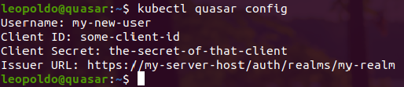

# Kubectl Quasar [](https://kubernetes.io/docs/reference/access-authn-authz/authentication/#openid-connect-tokens) [](https://kubernetes.io/docs/reference/kubectl/) [](https://www.keycloak.org/) [](https://www.python.org/) 

**kubectl-quasar** is a set of tools to use with kubectl. Writen in _python3_, **kubectl-quasar** runs as a plugin into kubectl, adding to him some functionalities:


### kubectl quasar config
**kubectl quasar config** - configures a new credential (or edit an existing) into kubeconfig file, based on OpenIDConnect protocol. 

```
$ kubectl quasar config
```
You need to inform some data in order to configure the new credential (new user entry on kubeconfig). Please get these data with your server admin.

- Username;
- Client ID;
- Client Secret;
- Issuer URL.





After that, you can configure (or edit) a context to work with an existing cluster and the new user created.

```
$ kubectl config set-context my-context-name --cluster=my-cluster --user=my-new-user
```

### kubectl quasar login
**kubectl quasar login** - allows to perform a simple login against any openid oauth2 authorization server (like keycloak, for example).

```shell
$ kubectl quasar login -u my-user -p my-password
```
After that, kubectl mantains a work session, renewing the refresh-token originally obtained by **kubectl quasar login** command. A new login is necessary only if the refresh-token expires (about 30 minutes of inactivity).

That's all folks. Feel free to contribute, fork this repo and share ideas for new functionalities
